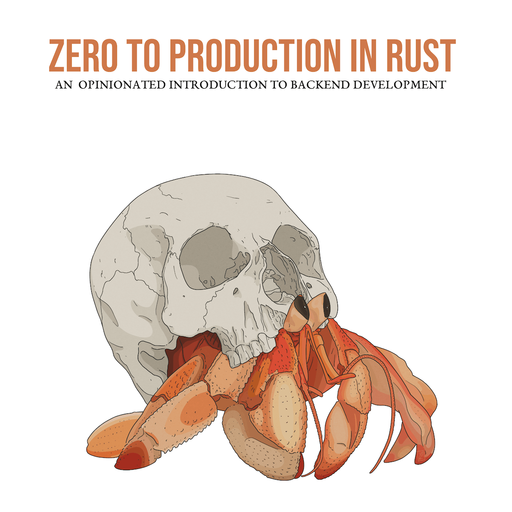

# 🦀 Zero To Production 🚀

> [Zero To Production In Rust](https://zero2prod.com) is an opinionated introduction to back-end development using Rust.
>
> BIG thanks to @[Luca Palmieri](https://github.com/LukeMathWalker) for writing this 📕 and all of his contributions to the community!



This repository contains my personal notes with excerpts and highlights of the book as I worked through it.

## Table of Contents

| Chapter                 | Title                        | Description                                     |
| ----------------------- | ---------------------------- | ----------------------------------------------- |
| [ch1](./docs/ch_01.md)  | Getting Started              | Setup and tooling                               |
| [ch2](./docs/ch_02.md)  | Building An Email Newsletter | Project planning                                |
| [ch3](./docs/ch_03.md)  | Sign Up a New Subscriber     | Pick the tech stack & wire it all up with tests |
| [ch4](./docs/ch_04.md)  | Telemetry                    | Implement logs then tracing                     |
| [ch5](./docs/ch_05.md)  | Going Live                   | Containerization, CI/CD                         |
| [ch6](./docs/ch_06.md)  | Reject Invalid Subscriber #1 | Form validation and code organization           |
| [ch7](./docs/ch_07.md)  | Reject Invalid Subscriber #2 | Wire up confirmation email flow                 |
| [ch8](./docs/ch_08.md)  | Error Handling               | Advanced and proper error handling              |
| [ch9](./docs/ch_09.md)  | Naive Newsletter Delivery    | Initial feature to send newsletter              |
| [ch10](./docs/ch_10.md) | Securing Our API             | TODO                                            |

## Run it locally

Make sure you have docker running.

```sh
# pull postgres
docker pull postgres

# install psql on macOS
brew install libpq

# seed and run postgres database in container
./scripts/init_db.sh

cargo run | bunyan
```
