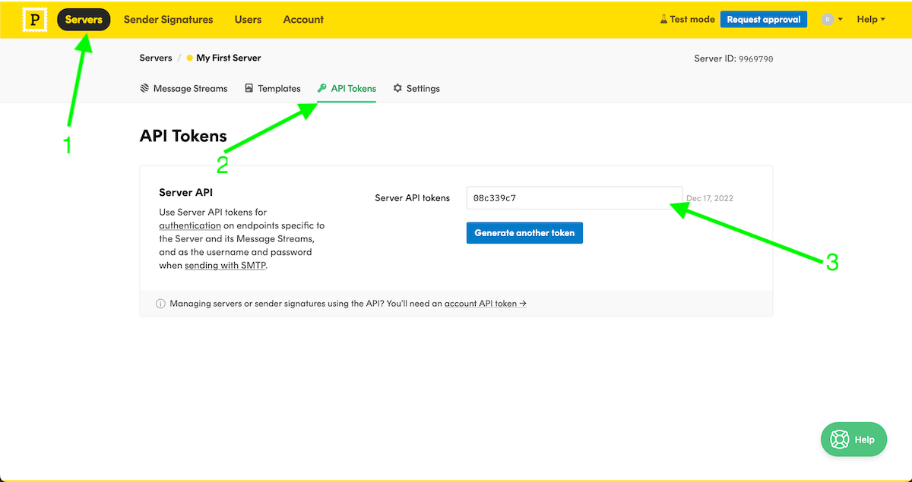

# Chapter 7 - Reject Invalid Subscribers #2

- [x] Write a module to send an email
- [x] Refactor `POST /subscriptions` to handle new business logic
- [ ] Write a `GET /subscriptions/confirm` request handler from scratch

## Subscriber Consent

Checking for user consent to opt-in to the newsletter upfront is not only a great user experience but some countries, like Europe, it's required by [law](https://www.litmus.com/blog/5-things-you-must-know-about-email-consent-under-gdpr/) to get explicit consent.

```
submit form -> server sends confirmation link -> user agrees -> success page
```

When a user subscribes to our newsletter, our request handler will:

- on `POST /subscriptions` we save user data to database; save with a `pending_confirmation` state
- generate a (unique) `subscription_token`
- store `subscription_token` in our database against their id in a `subscriptions_tokens` table
- send an email to the new subscriber containing a link structured as `https://<API-domain>/subscriptions/confirm`
- server returns a `200 OK`

When a user clicks the email confirmation:

- the link will perform a `GET /subscriptions/confirm`
- retrieve `subscription_token` from the query parameters
- retrieve the subscriber id associated with `subscription_token` from the `subscription_tokens` table
- update the subscriber status from `pending_confirmation` to active in the `subscriptions` table
- return a `200 OK`

Possible edge case(s):

- what if user clicks the confirmation link twice

## Connection Pooling

- You need to establish a connection when executing an `HTTP` request against an API hosted on a remote server
- Connecting to a remote server is an expensive operation, even more so if it's `HTTPS`
- Establishing a _brand-new_ connection every time we need to fire off a request can impact the performance of our application
  - might end up leading to a problem known as socket-exhaustion under load
- Connection pooling helps mitigate socket-exhaustion
  - After the first request to the remote server has been completed, it will keep the connection open (briefly) and re-use it if we need it again
- reqwest's `Client` instance initialises a connection pool under the hood
- To leverage this connection pool we need to **reuse the same Client** across multiple requests
- Important to note that `Client::clone` does not create a new connection pool - we just clone a pointer to the underlying pool

How to **reuse** the same `reqwest::Client` in actix-web?

- Create a singleton and store a copy of the pointer in the application context.
- Handlers using an extractor can retrieve the reference

## HTTP Mocking with [wiremock](https://crates.io/crates/wiremock)

- `wiremock::MockServer` is a full-blown HTTP server
- `MockServer::start` asks the operating system for a random available port and spins up the server on a background thread, ready to listen for incoming requests.
- We can retrieve the **address** to our `MockServer` by `MockServer::uri`
- Out of the box (default) `wiremock::MockServer` returns a `404` to all incoming requests
- When `wiremock::MockServer` receives a request, it iterates over all the mounted mocks to check if the request matches their conditions.
- `any()` = "Match all incoming requests, regardless of their method, path, headers or body. You can use it to verify that a request has been fired towards the server, without making any other assertion about it"
  - Basically, it always matches, regardless of the request

## The Intent of A Test Should Be Clear

- Using random data conveys a specific message: do not pay attention to these inputs, their values do not influence the outcome of the test, that’s why they are random!
- Hard-coded values, instead, should always give you pause:
  - does it matter that `subscriber_email` is set to?
  - Should the test pass if I set it to another value?

## First Sketch Of `EmailClient::send_email`

```sh
curl "https://api.postmarkapp.com/email" \
  -X POST \
  -H "Accept: application/json" \
  -H "Content-Type: application/json" \
  -H "X-Postmark-Server-Token: <TOKEN>" \
  -d '{
  "From": "<SENDER>",
  "To": "<RECEIVER>",
  "Subject": "Postmark test",
  "TextBody": "Hello dear Postmark user.",
  "HtmlBody": "<html><body><strong>Hello</strong> dear Postmark user.</body></html>",
  "MessageStream": "outbound"
}'

{
  "To": "<RECEIVER>",
  "SubmittedAt": "2022-12-18T03:56:11.9538896Z",
  "MessageID": "de45adc4-8924-40dc-a992-85bea0e89239",
  "ErrorCode": 0,
  "Message": "OK"
}
```

- SENDER = the email address you used to sign up
- RECEIVER = must be the same domain as your SENDER email in a **test** account mode
- TOKEN = `08c339c7-xxxx-xxxx-xxxx-xxxxxxxxxxxx`

You can retrieve your API token here:



## Avoid Unnecessary Memory Allocations

```rust
let request_body = SendEmailRequest {
  from: self.sender.as_ref().to_owned(),
  to: recipient.as_ref().to_owned(),
  subject: subject.to_owned(),
  html_body: html_content.to_owned(),
  text_body: text_content.to_owned(),
};
```

- For each field we are allocating a bunch of _new memory_ to store a cloned `String`; very wasteful
- It would be more efficient to reference the existing data without performing any additional allocations
- We can do so by restructuring `SendEmailRequest` to use `&str` (string slice) instead of `String` (struct)
- A string slice (`&str`) is just a pointer to a memory buffer owned by somebody else
- To store a reference in a struct we need to add a lifetime parameter; so the compiler can track how long they live for

```rust
struct SendEmailRequest<'a> {
    from: &'a str,
    to: &'a str,
    subject: &'a str,
    html_body: &'a str,
    text_body: &'a str,
}
```

`as_ref().to_owned()` is a method chain that involves two steps:

- `as_ref()`: This method converts a value into a reference. It is often used to convert a value of a type that implements the AsRef trait into a reference of a type that implements the AsRef trait. This is useful because many functions and methods accept a reference rather than a value, and as_ref() allows you to pass a value as a reference without explicitly creating the reference yourself.
- `to_owned()`: This method creates an owned version of a value that implements the ToOwned trait. It creates a new value by allocating memory and copying the original value into it. This is often used when you have a reference to a value and you want to have an owned version of it.

So, in the case of `.as_ref().to_owned()`, as_ref() is called on a string literal, which is then converted into a &str (string slice) reference. The to_owned() method is then called on the &str reference, creating an owned String value from the string slice.
In other words, `.as_ref().to_owned()` creates a new String value by allocating memory and copying the contents of the string literal into it. It is essentially a copy of the string literal.

## Timeouts

A server can start misbehaving when it accumulates several _"hanging"_ requests

Since we are not haning up the connection to the server, it makes the connection busy; and every time we hit the server we need to open a new connection.
And if the server does not recover fast enough, and we do not close any of the open connections, you'll end up with **socket exhaustion/performance degradation**

> As a rule of thumb: every time you are performing an IO operation, always set a timeout!
> If the server takes longer than the timeout to respond, we should fail and return an error.

- Choosing the right timeout value/duration is more art than science
  - especially if retries are involved
    - set it **too low** and you might overwhelm the server with too many retry requests
    - set it **too high** and you risk **degradation** on the client side
- Nevertheless, it's still better and important to have a _conservative_ timeout threshold than NONE at all

with `reqwest`:

- Add a default timeout on the `Client` itself which applies to all outgoing requests
- Or specify a per-request timeout

## One Test File, One Crate

- The `tests/` directory is special; `cargo` knows to look into it for integration tests
- Each file in `tests/` gets compile as its own _crate_
- You can see this by running `cargo build --tests` and look in `target/debug/deps`

```sh
# finds and filters for executables and name containing health_check
find target/debug/deps -maxdepth 1 -perm -111 -type f | grep health_check
  target/debug/deps/health_check-24c0ae463239596c
  target/debug/deps/health_check-84989f40d2eae3a1
  target/debug/deps/health_check-dd32eb352e16afe3 <--- Exec me

# execute the last file from the list above
target/debug/deps/health_check-dd32eb352e16afe3
  running 4 tests
  test subscribe_returns_a_400_when_fields_are_present_but_invalid ... ok
  test health_check_works ... ok
  test subscribe_returns_a_400_when_data_is_missing ... ok
  test subscribe_returns_a_200_for_valid_form_data ... ok

  test result: ok. 4 passed; 0 failed; 0 ignored; 0 measured; 0 filtered out; finished in 0.83s
```

## Sharing Test Helpers

```sh
tests/
  api/
    health_check.rs
    helpers.rs
    main.rs
    subscriptions.rs
```

👆 creates sub-modules _scoped to a single test executable_.

```rust
# main.rs
mod health_check;
mod helpers;
mod subscriptions;
```

We are structuring `tests/api` in the very same way we would structure a binary crate.

## Zero Downtime Deployments

- `99.99%` also known as the _"four nines of availability"_
- `99.99%` usually equals to only 52 minutes of downtime over a whole year

## Health Checks

We can ask the load balancer to keep an eye on the health of the registered backends.

Oversimplifying, health checking can be:

- Passive - the load balancer looks at the distribution of status codes/latency for each backend to determine if they are healthy or not;
- Active - the load balancer is configured to send a health check request to each backend on a schedule. If a backend fails to respond with a success status code for a long enough time period it is marked as unhealthy and removed.

This is a critical capability to achieve self-healing in a cloud-native environment: the platform can detect if an application is not behaving as expected and automatically remove it from the list of available backends to mitigate or nullify the impact on users.

## Terminology

- Service Level Agreement (SLA) is a contractual obligation: you guarantee a certain level of reliability and commit to com- pensate your customers (usually with discounts or credits) if your service fails to live up to the expectations.
- Load Balancer sits in front of `n` replications of our application, every time somebody sends a request to our API, they hit our load balancer which is then in charge of choosing one of the available backends to fulfill the incoming request.
- Horizontal scaling is spinning up more replicas of our application to help handle a spike in traffic.

`src/routes/subscriptions_confirm.rs`:

```rust
use actix_web::{HttpResponse, web};

#[derive(serde::Deserialize)]
pub struct Parameters {
    subscription_token: String
}

#[tracing::instrument(
  name = "Confirm a pending subscriber",
  skip(_parameters)
)]
pub async fn confirm(_parameters: web::Query<Parameters>) -> HttpResponse {
  HttpResponse::Ok().finish()
}
```

- `Parameters` defines all the query parameters we `expect` to see in the incoming requests
- I needs to implement `serde::Deserialize` to enable actix-web to build it from the incoming request path
- By adding `web::Query<Parameter>` to instruct actix-web to only call the handler if the extraction was successful
- If the extraction failed a `400 Bad Request` is automatically returned to the caller

## 📦 Used

- [reqwest](https://crates.io/crates/reqwest)
- [wiremock](https://crates.io/crates/wiremock)
- [serde_json](https://crates.io/crates/serde_json)
- [linkify](https://crates.io/crates/linkify)

## References

- [socket socket-exhaustion](https://www.aspnetmonsters.com/2016/08/2016-08-27-httpclientwrong/)
- [send a single email](https://postmarkapp.com/developer/user-guide/send-email-with-api#send-a-single-email)
- [coverage marks](https://ferrous-systems.com/blog/coverage-marks/)
- [blue green deployments](https://martinfowler.com/bliki/BlueGreenDeployment.html)
- [canary deployments](https://martinfowler.com/bliki/CanaryRelease.html)
